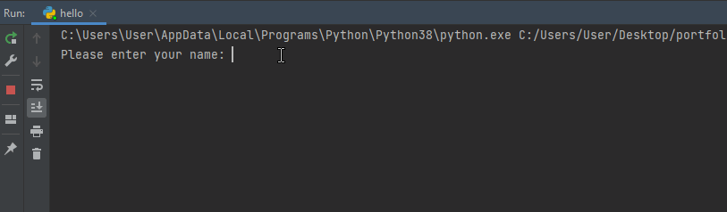

Solution to the second stage featuring a simple program that prints out my name and a resume with a contact form. 

# First Solution: 'Name Program'
The 'hello.py' file.


## Features:
- A simple function that requests for a name(string) input and prints out Hello + "name"
``` py
  print_name()
  
  Please enter your name:  
```


# Second Solution: Resume

- Built using flask and a free [bootstrap](https://bootstrapmade.com/) template.
- A flask-wtf contact form with some validation.
- Deployed [here](https://ayoola-portfolio.herokuapp.com/) using [Heroku](https://www.heroku.com).